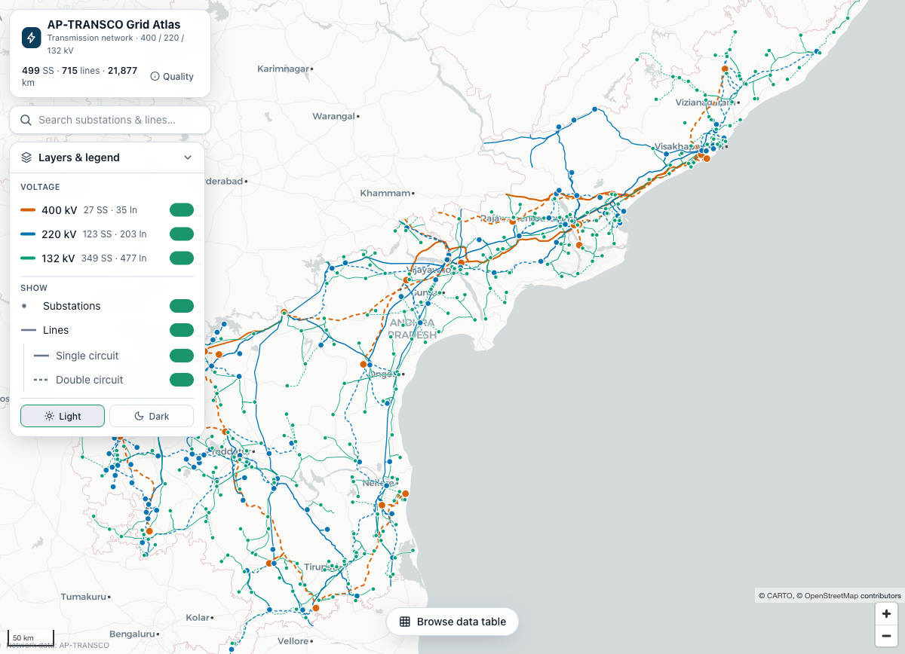

# AP-TRANSCO Grid Atlas

An interactive GIS + MIS lookup for the **AP-TRANSCO transmission network** — 400 / 220 / 132 kV
lines and substations. Search, filter, and click any feature on a map to see its details and
spatially-inferred connections, with a synced data table for browsing the whole network.

100% static and client-side: no backend, no database, no API keys. Runs locally and deploys to
GitHub Pages.



## Features

- **Map-primary UI** with floating glass panels; **Light / Dark / Satellite** basemaps
  (keyless CARTO vector + Esri World Imagery).
- **Voltage-coded network** — colour (Okabe-Ito, colour-blind safe) paired with redundant line
  width and a dashed style for double-circuit lines, plus a casing halo for legibility.
- **Typeahead search** across all substations and lines, with disambiguation for same-named
  substations (e.g. the 400 kV vs 220 kV "Chittoor").
- **Detail panel** showing the normalized MIS attributes plus **inferred substation↔line
  connections** (with route-km and circuit-km), and a back breadcrumb for navigating between
  connected features.
- **Summary dashboard** with KPI totals and drill-down disaggregation **by voltage** and **by
  circle/region** — counts, route-km and **circuit-km** (DC ×2) per group, with isolate-on-map.
- **Data table** (sortable, filterable) in a bottom sheet, two-way synced with the map.
- **Layer controls** for voltage levels, substations/lines, and single/double circuits.
- **Deep links** — selection, basemap, filters and table state are encoded in the URL hash, so any
  view is bookmarkable/shareable.
- **Data-quality view** reporting coverage, schema variants, and adjacency match rates honestly.

## Architecture

```
data/raw/Transco.kml ──(build-time ETL)──▶ public/data/*.{geojson,json} ──▶ React + MapLibre app ──▶ GitHub Pages
```

The 4.2 MB KML is **never parsed in the browser**. A one-time ETL normalizes it into small, clean
static assets.

| Layer | Path | Responsibility |
|-------|------|----------------|
| ETL | `scripts/build-data.mts`, `scripts/etl-lib.ts` | KML → normalized GeoJSON + meta + search index + data-quality report |
| Data | `src/data/` | typed loaders, selectors (adjacency/stats) |
| State | `src/state/`, `src/url/` | Zustand store + versioned URL-hash sync |
| Map | `src/map/` | MapLibre setup, CARTO basemaps, voltage/circuit layer styling |
| UI | `src/components/` | search, detail panel, data table, controls, legend, quality view |

### Key data decisions (validated against the source KML)

- **Folder path is authoritative** for voltage (400/220/132) and circuit (SC/DC). Line *names* are
  only used to raise review flags (`circuitAmbiguous`, `voltageMismatch`) — 26% of names contain
  "DC/SC", so they must never override the folder.
- **IDs are synthetic** (`SS_CODE` / sequence), never bare names — 24 distinct substations share a
  name with another (different voltage/location), so name-keying would merge real facilities.
- **Adjacency is geometric**: each line endpoint is snapped to the nearest substation within 500 m
  (~92% of lines link at both ends, 100% at ≥1). The remaining endpoints are genuine external nodes
  (railway traction, generating stations, out-of-state substations) with no point in the dataset.
  Connections are always shown as **inferred**, never authoritative.
- **Circuit-km** is derived per line as route length × circuits (SC ×1, DC ×2).
- **Circle/region** is recorded in the source only for 132 kV substations; 400/220 kV substations
  (and their lines) are assigned the **nearest circle-bearing substation's circle** (flagged as
  inferred in the detail panel and the data-quality report).

### Not in the source data

The KML contains **no MVA / transformer-capacity / thermal-rating data** — only codes, voltage,
circle, commissioning date, coordinates and route length. To add capacities, supply a
supplementary sheet (keyed by `SS_CODE` / line name) and join it in the ETL; the UI is structured
to surface those fields wherever present.

## Develop

```bash
npm install          # all deps are local; nothing is installed globally
npm run build:data   # regenerate public/data/* from data/raw/Transco.kml
npm run dev          # http://localhost:5173/ap-gis-grid/
npm test             # ETL unit tests + emitted-data integrity checks
npm run typecheck
```

The source KML lives at `data/raw/Transco.kml`. To rebuild after replacing it, run
`npm run build:data` and review `public/data/data-quality.json`.

## Deploy (GitHub Pages — project site)

1. Push to `main`. The workflow in `.github/workflows/deploy.yml` runs the ETL, tests, and build,
   then publishes `dist/` to Pages.
2. In the repo: **Settings → Pages → Build and deployment → Source = GitHub Actions**.
3. The site serves at `https://<user>.github.io/ap-gis-grid/`.

The Vite `base` is `/ap-gis-grid/` (see `vite.config.ts`), overridable via the `BASE_PATH` env var —
set it to `/` for a `<user>.github.io` user/org site, or to `/<new-name>/` if the repo is renamed.

## Tech stack

Vite · React 19 · TypeScript · Tailwind CSS v4 · MapLibre GL JS v5 · Zustand · TanStack Table ·
`@tmcw/togeojson` + `@xmldom/xmldom` + `node-html-parser` (ETL).

## Attribution

- Light/Dark basemaps © [OpenStreetMap](https://www.openstreetmap.org/copyright) contributors,
  © [CARTO](https://carto.com/attributions) (keyless, non-commercial fair use).
- Satellite basemap: Imagery © Esri, Maxar, Earthstar Geographics and the GIS User Community
  (keyless World Imagery; intended for internal / non-commercial use — see Esri's terms before any
  commercial use).
- Network data: AP-TRANSCO.
